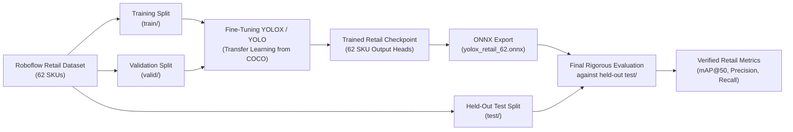

# Detector Evaluation & Retail Benchmark Workflow

## 1. Overview & Evaluation Baseline

The baseline vision service in this repository uses a local **YOLOX-S** ONNX model pretrained on the standard **Microsoft COCO dataset (80 object categories)**.

To evaluate retail shelf intelligence, a benchmark dataset with 62 granular retail product SKUs is placed locally under:
```text
benchmark/retail-shelf/
├── data.yaml
├── train/
│   ├── images/
│   └── labels/
├── valid/
│   ├── images/
│   └── labels/
└── test/
    ├── images/
    └── labels/
```

### Dataset Provenance
- **Dataset**: `grocery-rfn8l` (v9) from Roboflow Universe (`lamar-university-venef/grocery-rfn8l/9`)
- **License**: Creative Commons Attribution 4.0 International (CC BY 4.0)
- **Classes**: 62 retail SKU classes (beverages, snacks, confectionery, etc.)
- **Format**: Standard YOLO normalized bounding box format (`class_id x_center y_center width height`)

---

## 2. COCO vs. Retail SKU Class Vocabulary Incompatibility

### The Vocabulary Mismatch Problem

The pretrained YOLOX-S model outputs predictions in the **80 COCO classes**, whereas the retail shelf benchmark dataset defines **62 SKU-level classes**:

| Index | COCO Class (Model) | Retail Benchmark Class (`data.yaml`) |
|---|---|---|
| `0` | `person` | `BargsBlack20Oz` |
| `1` | `bicycle` | `BuenoShareSize` |
| `2` | `car` | `CheetosCrunchy` |
| `3` | `motorcycle` | `CheetosCrunchyFlaminHot` |
| `...` | `...` | `...` |
| `39` | `bottle` | `LennyLarrysSnickerdoodle` |
| `...` | `...` | `...` |
| `61` | `toilet` | `ZeroCocaCola16Oz` |

### Why Direct Evaluation is Scientifically Invalid

Directly evaluating the pretrained COCO YOLOX-S model against the 62-class retail annotations without vocabulary mapping is invalid:
1. **Semantic Collision**: Label `0` in the retail dataset (`BargsBlack20Oz`) would be incorrectly treated as `person` (COCO `0`). A bottle correctly localized by the detector as a COCO `bottle` (class `39`) would be evaluated against ground-truth `person` (class `0`), registering both a false positive and a false negative.
2. **False Metrics**: Reporting precision, recall, or AP50 computed from this index misalignment would produce meaningless metrics and misrepresent detector capability.

### Evaluator Safety Enforcement

The evaluation script (`backend/scripts/evaluate_detector.py`) and evaluation service (`backend/app/services/evaluation.py`) enforce vocabulary safety:
- Discovers `data.yaml` to read dataset class names and count (`nc`).
- Compares model vocabulary against dataset vocabulary.
- If incompatible, the evaluator **fails safely** with exit code 2 and outputs a structured error report detailing the vocabulary mismatch, refusing to fabricate SKU metrics.

---

## 3. Running the Evaluator

From `backend/`:

### Standard / Direct Evaluation (Requires Compatible Vocabulary)
```bash
python scripts/evaluate_detector.py ../benchmark/retail-shelf --split test
```
*If run with a COCO-trained model on the 62-class dataset, this will safely reject the execution with `incompatible_vocabulary` error.*

### Class-Agnostic Localization Benchmark (Diagnostic)
To measure the detector's capability to localize physical retail shelf items (bounding box overlap / objectness recall) without claiming SKU classification accuracy:
```bash
python scripts/evaluate_detector.py ../benchmark/retail-shelf --split test --class-agnostic --output ../benchmark/localization_report.json
```

---

## 4. Roadmap: Retail Model Fine-Tuning & Evaluation

To achieve valid, high-accuracy SKU-level detection:



### 1. Training & Validation
- Use `train/` (training partition) and `valid/` (validation partition for early stopping and hyperparameter selection).
- Initialize weights from COCO pretrained checkpoint.
- Replace detection head with a 62-class classification and regression head.

### 2. Held-Out Test Evaluation
- **Strictly reserve `test/`** for post-training benchmark evaluation.
- No training, tuning, or hyperparameter selection should use the `test/` split.

### 3. ONNX Export & Deployment
- Export the trained PyTorch checkpoint to ONNX (`model_input_size: 640x640`).
- Update `backend/app/services/vision.py` with the retail class list.
- Run `backend/scripts/evaluate_detector.py` to produce final verified AP50, precision, and recall metrics.
